# QuickPlate - Food Delivery Website

## 📋 Project Overview

QuickPlate is a comprehensive food delivery web application built with PHP and MySQL. The platform allows users to browse restaurants, view menus, add items to cart, place orders, and manage their accounts. It features both customer and admin interfaces for complete order management.

## 🖼️ User Interfaces

Home Page

<p align="center"> 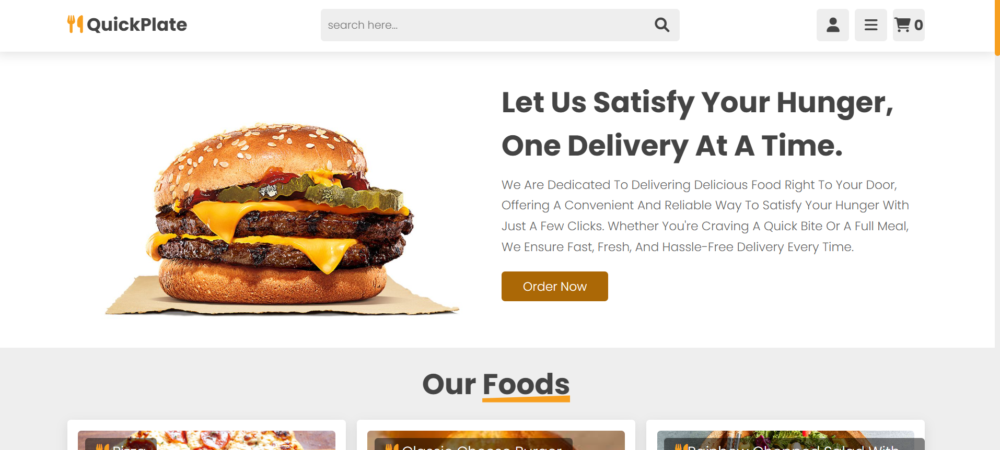 </p>
<p align="center"> 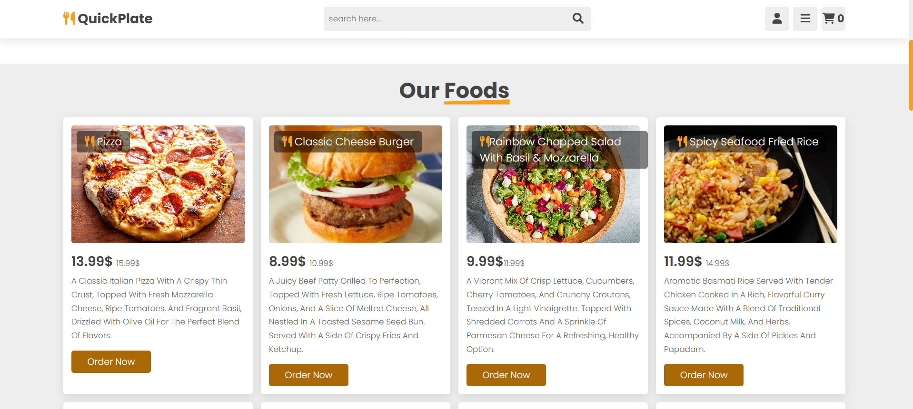 </p>
<p align="center">  </p>
<p align="center">  </p>
<p align="center">  </p>

Register Page
<p align="center"> 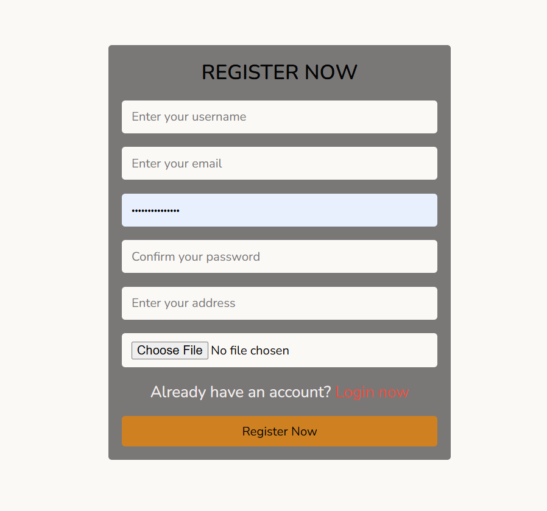 </p>
 

Login Page 

<p align="center"> 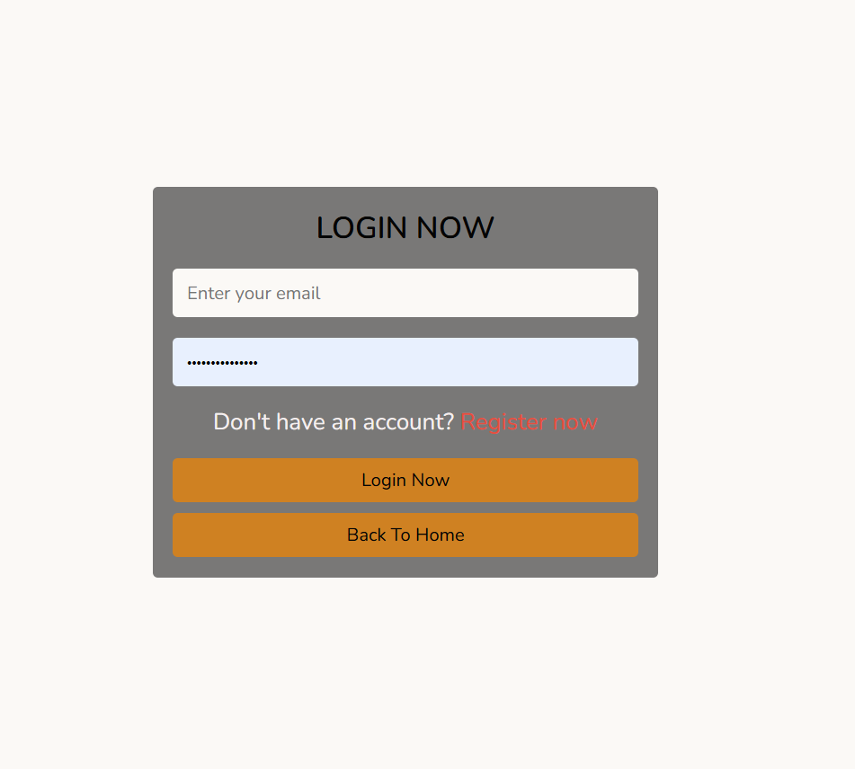 </p>


Resturant Menu Page

<p align="center"> 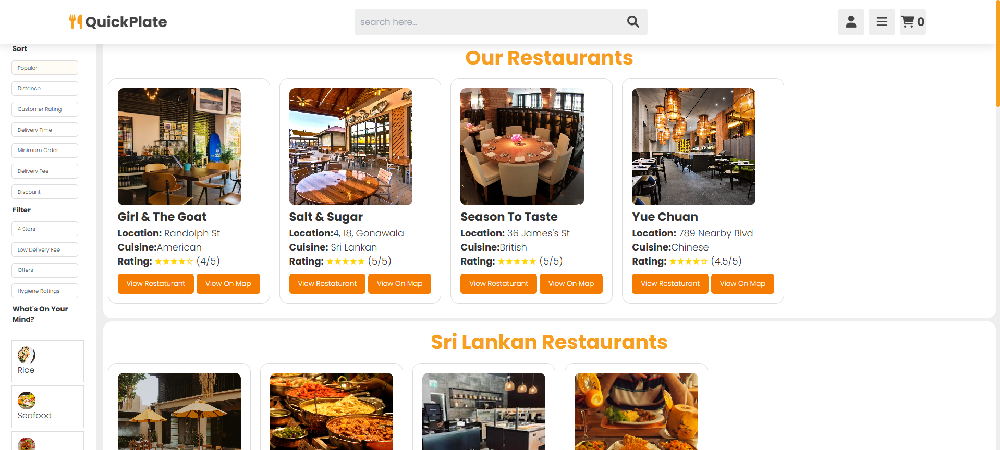 </p>

Girl & The Goat Restaurant Page

<p align="center"> 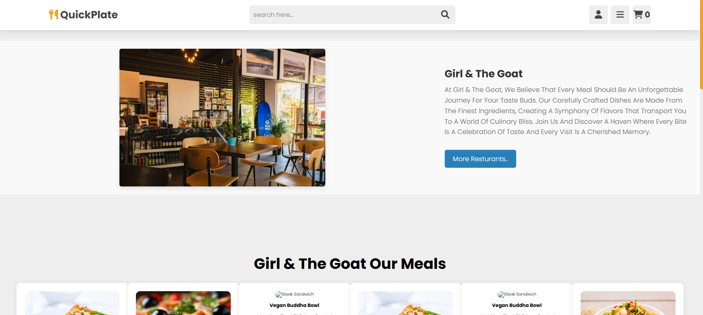 </p>
<p align="center"> 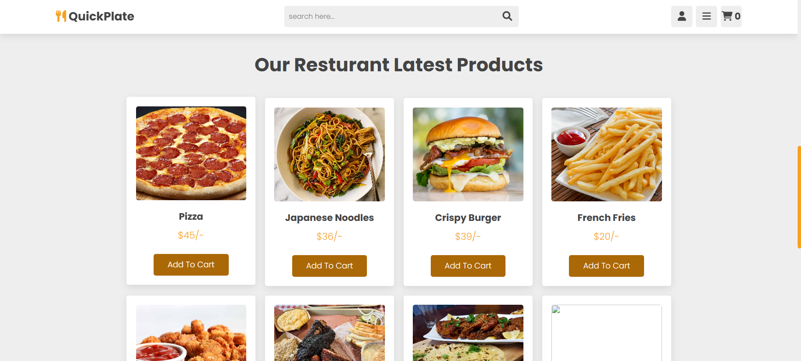 </p>

Salt & Sugar Resturant  Page

<p align="center"> 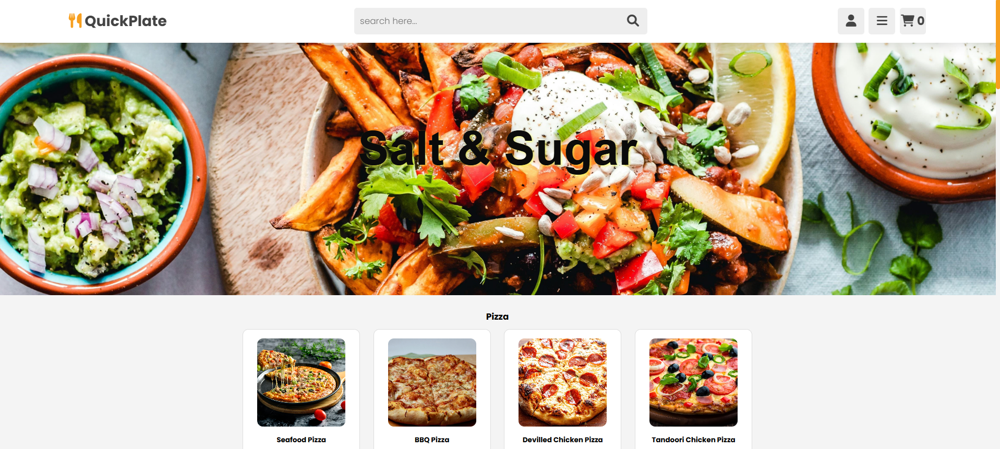 </p>
<p align="center"> 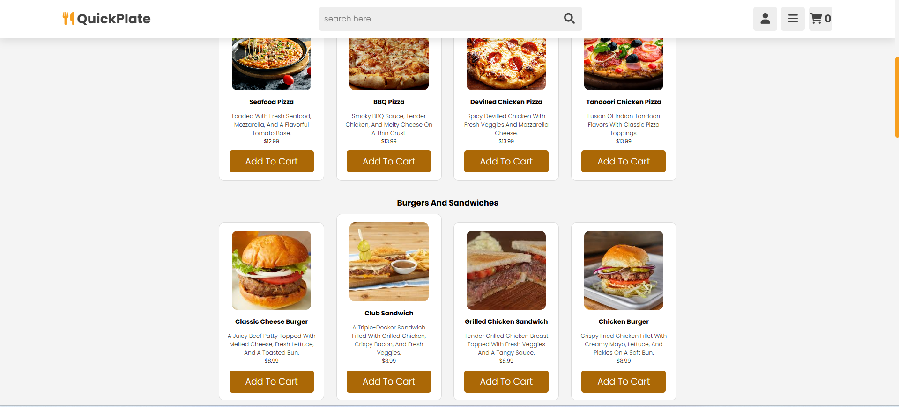 </p>
User Profile  Page

<p align="center"> 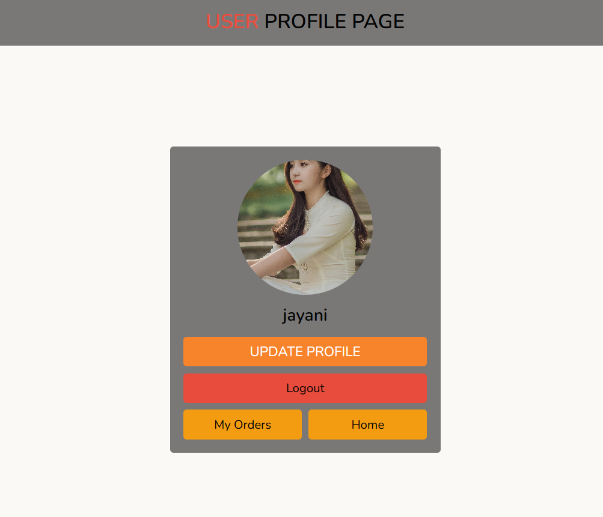 </p>
<p align="center"> 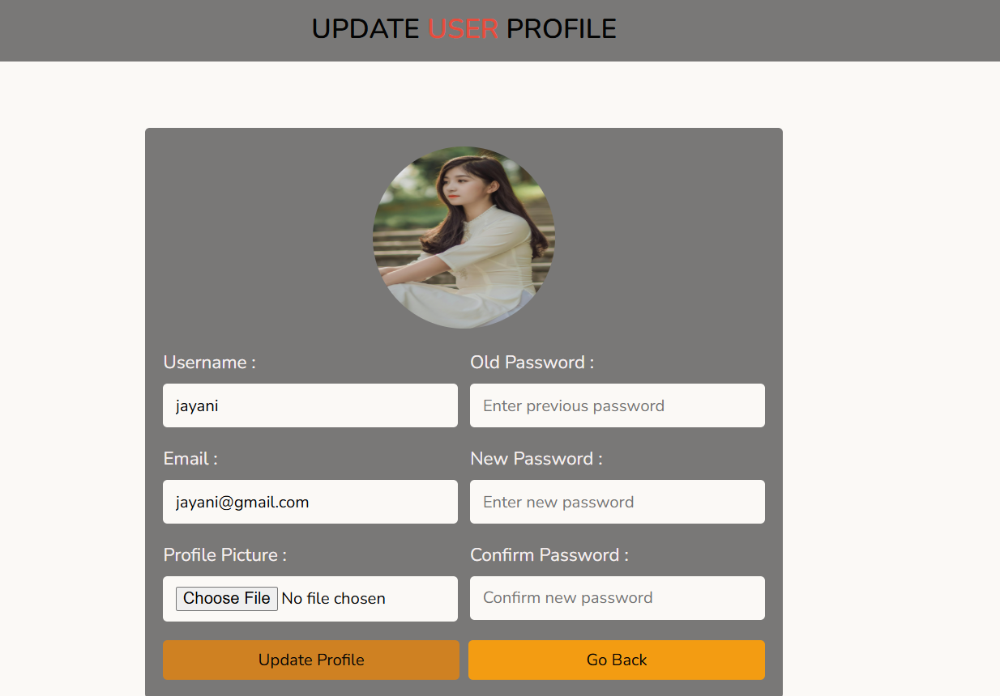 </p>

Admin Profile  Page

<p align="center"> 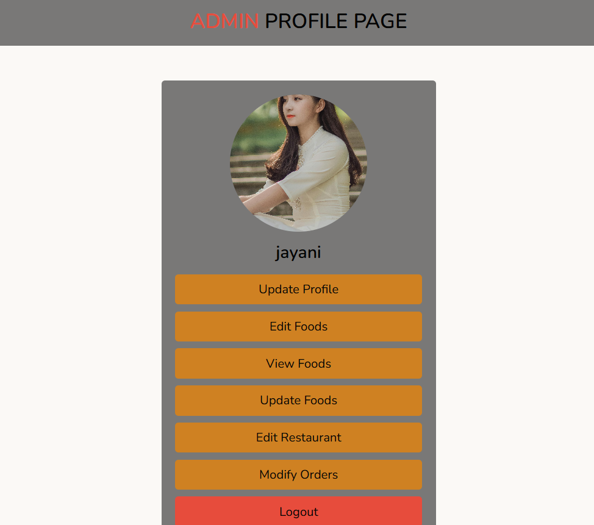 </p>
<p align="center"> 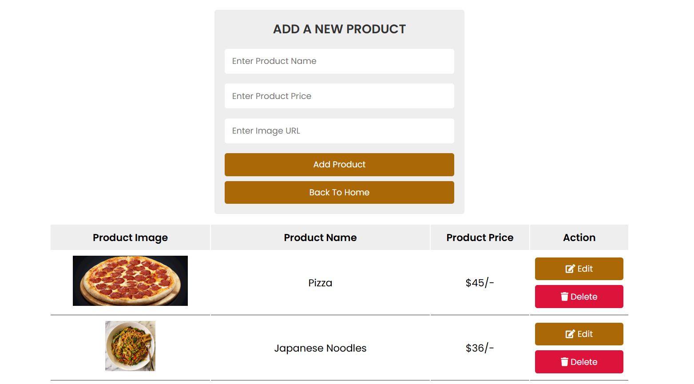 </p>
<p align="center"> 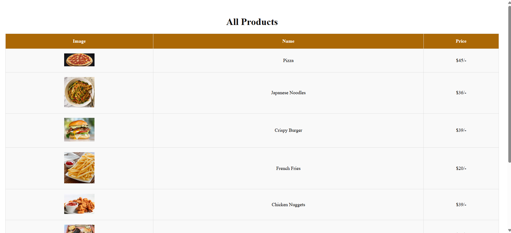 </p>


## 🚀 Features

### Customer Features
- **Restaurant Browsing**: Browse restaurants by cuisine type (Italian, Chinese, Indian, Sri Lankan, Cafes)
- **Menu Categories**: View detailed menu categories with food items and descriptions
- **Restaurant Profiles**: Individual restaurant pages with menus and ordering
- **Shopping Cart**: Add items to cart with quantity management
- **User Authentication**: Login/Register system for customers
- **Order Tracking**: Track order status
- **Search Functionality**: Search for restaurants and food items
- **Responsive Design**: Mobile-friendly interface

### Admin Features
- **Admin Dashboard**: Complete admin panel for management
- **Product Management**: Add, edit, and delete food items
- **User Management**: Manage customer accounts
- **Order Management**: View and update order status
- **Admin Authentication**: Secure admin login system

### Restaurant Features
- **Multiple Restaurants**: 
  - Girl & The Goat (American cuisine)
  - Season to Taste (British cuisine)
  - Yue Chuan (Chinese cuisine)
  - Hela Rasa (Sri Lankan cuisine)
  - Various cafes and specialty restaurants

## 🛠️ Technology Stack

- **Backend**: PHP 8.0+
- **Database**: MySQL/MariaDB
- **Frontend**: HTML5, CSS3, JavaScript
- **Server**: Apache (XAMPP)
- **Libraries**: 
  - Font Awesome (Icons)
  - Swiper.js (Sliders)
  - AOS (Animation on Scroll)

## 📁 Project Structure

```
web/
├── index.php                 # Homepage
├── config.php               # Database configuration
├── database.php            # Database connection
├── cart.php                # Shopping cart page
├── checkout.php            # Checkout process
├── reslisting.php          # Restaurant listing page
├── rest1menu.php           # Menu categories page
├── resturant1.php          # Individual restaurant pages
├── resturant4.php
├── res5.php
├── TrackOrder.html         # Order tracking
├── admin/                  # Admin panel
│   ├── admin_page.php     # Admin dashboard
│   ├── login.php          # Admin login
│   ├── register.php       # User registration
│   ├── products.php       # Product management
│   ├── user_page.php      # User dashboard
│   └── css/               # Admin stylesheets
├── css/                   # Main stylesheets
├── js/                    # JavaScript files
├── images/                # Image assets
├── DB/                    # Database files
│   └── quickplate.sql     # Database schema
└── res2/                  # Additional restaurant module
```

## 🗄️ Database Schema

The application uses a MySQL database named `quickplate` with the following main tables:

- **user**: User account information
- **admin**: Admin account credentials
- **cart**: Shopping cart items
- **products**: Food items and menu data
- **orders**: Customer orders (if implemented)

## 🚀 Installation & Setup

### Prerequisites
- XAMPP or similar local server environment
- PHP 8.0 or higher
- MySQL/MariaDB
- Web browser

### Installation Steps

1. **Clone/Download the project**
   ```bash
   # Place the project in your XAMPP htdocs directory
   C:\xampp\htdocs\SF-CourseWork\web\
   ```

2. **Start XAMPP Services**
   - Start Apache
   - Start MySQL

3. **Create Database**
   - Open phpMyAdmin (http://localhost/phpmyadmin)
   - Create a new database named `quickplate`
   - Import the SQL file: `DB/quickplate.sql`

4. **Configure Database Connection**
   ```php
   // config.php
   $conn = mysqli_connect('localhost','root','','quickplate') or die('connection failed');
   ```

5. **Access the Application**
   - Homepage: `http://localhost/SF-CourseWork/web/index.php`
   - Admin Panel: `http://localhost/SF-CourseWork/web/admin/login.php`

## 🎯 Usage Guide

### For Customers
1. **Browse Restaurants**: Visit the homepage and click "Restaurants" to view available options
2. **View Menus**: Click on any restaurant to view their menu and prices
3. **Add to Cart**: Select items and add them to your shopping cart
4. **Register/Login**: Create an account or login to place orders
5. **Checkout**: Complete your order through the checkout process
6. **Track Orders**: Use the order tracking feature to monitor delivery status

### For Administrators
1. **Admin Login**: Access the admin panel via `/admin/login.php`
2. **Manage Products**: Add, edit, or remove food items
3. **User Management**: View and manage customer accounts
4. **Order Management**: Process and update order statuses

## 🍴 Restaurant Categories

- **American**: Girl & The Goat
- **British**: Season to Taste
- **Chinese**: Yue Chuan, Dragon Kitchen, Tasty China
- **Indian**: Indian Food Corner, Masala Majesty, Nutmeg
- **Italian**: Italian Bistro, Italian Corner
- **Sri Lankan**: Hela Rasa, Ceylon Taste, Rice & Curry, Curry Leaf
- **Cafes & Beverages**: Cool Zone, Cool Bar, Drinks and Bites

## 🎨 Design Features

- **Responsive Layout**: Works on desktop, tablet, and mobile devices
- **Modern UI**: Clean and intuitive user interface
- **Interactive Elements**: Hover effects, animations, and smooth transitions
- **Image Galleries**: Attractive food photography and restaurant images
- **Rating System**: Customer reviews and star ratings
- **Search Functionality**: Easy-to-use search and filtering options

## 🔧 Configuration

### Database Configuration
Update the database connection settings in `config.php`:
```php
$conn = mysqli_connect('localhost','root','','quickplate') or die('connection failed');
```

### File Paths
Ensure all file paths are correctly set for your local environment. The project assumes XAMPP installation on Windows.

## 🚀 Future Enhancements

- Online payment integration
- Real-time order tracking
- Push notifications
- Mobile app development
- Advanced admin analytics
- Multi-language support
- Delivery driver interface

 

## 🤝 Contributing

This is a coursework project. If you want to contribute:
1. Fork the repository
2. Create a feature branch
3. Make your changes
4. Submit a pull request

 
 

**Project Type**: Web Development Coursework  
**Framework**: Pure PHP with MySQL  
**Development Environment**: XAMPP  
**Target Platform**: Web Browser
